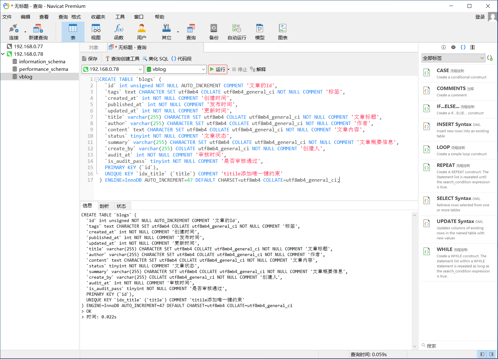
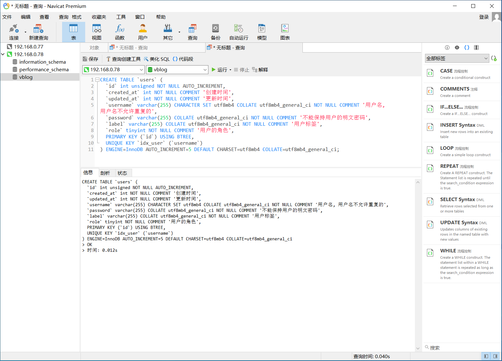
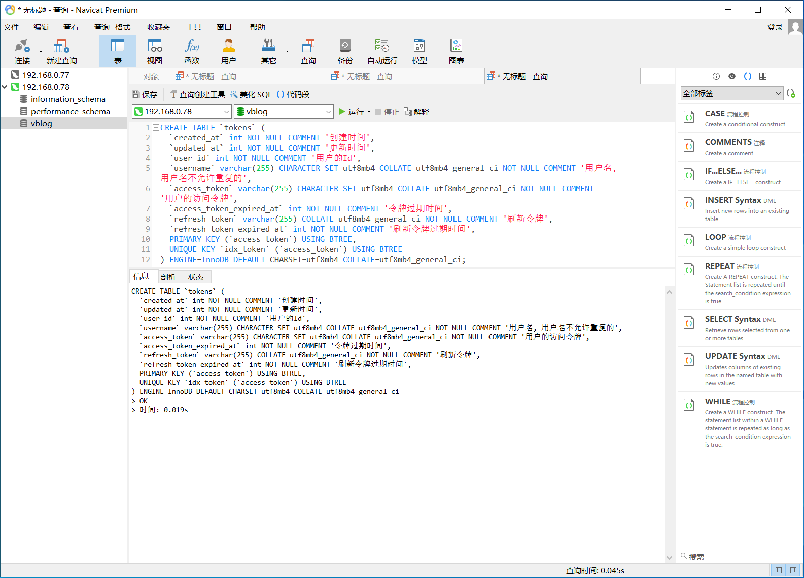

# 这是自己的练习项目

## git连接

```sh
git remote add origin https://github.com/dawson283067/vblog_me.git
git branch -M main
git push --set-upstream origin main

git add .
git commit -m "初始化项目"
```

## 数据库创建

CentOS7.9

```sh
# 下载配置repo的软件包并安装
[root@centos7 ~]# wget https://repo.mysql.com/mysql80-community-release-el7-7.noarch.rpm

[root@centos7 ~]# rpm -ivh mysql80-community-release-el7-7.noarch.rpm

# 找到并替换repo文件内的gpgcheck值
[root@centos7 ~]# find / -name *.repo

[root@centos7 ~]# sed -i 's#^gpgcheck=1#gpgcheck=0#g' /etc/yum.repos.d/mysql-community.repo

# 安装MySQL8.0.x的最新版本
[root@centos7 ~]# yum install mysql-community-server -y

[root@centos7 ~]# mysql -V
mysql  Ver 8.0.36 for Linux on x86_64 (MySQL Community Server - GPL)

# 启动MySQL
[root@centos7 ~]# systemctl start mysqld

# 查找root用户临时密码
[root@centos7 ~]# cat /var/log/mysqld.log | grep password
2024-02-26T02:58:13.209987Z 6 [Note] [MY-010454] [Server] A temporary password is generated for root@localhost: OMr;/gneh0hv

# 登录后查看密码策略
[root@centos7 ~]# mysql -uroot -p'OMr;/gneh0hv'
mysql: [Warning] Using a password on the command line interface can be insecure.
Welcome to the MySQL monitor.  Commands end with ; or \g.
Your MySQL connection id is 8
Server version: 8.0.36

Copyright (c) 2000, 2024, Oracle and/or its affiliates.

Oracle is a registered trademark of Oracle Corporation and/or its
affiliates. Other names may be trademarks of their respective
owners.

Type 'help;' or '\h' for help. Type '\c' to clear the current input statement.

mysql> show variables like 'validate_password%'；
+-------------------------------------------------+--------+
| Variable_name                                   | Value  |
+-------------------------------------------------+--------+
| validate_password.changed_characters_percentage | 0      |
| validate_password.check_user_name               | ON     |
| validate_password.dictionary_file               |        |
| validate_password.length                        | 8      |
| validate_password.mixed_case_count              | 1      |
| validate_password.number_count                  | 1      |
| validate_password.policy                        | MEDIUM |
| validate_password.special_char_count            | 1      |
+-------------------------------------------------+--------+
8 rows in set (0.01 sec)

# 修改MySQL配置文件，改变密码策略
[root@centos7 ~]# vim /etc/my.cnf
添加如下：
validate_password.length=6
validate_password.policy=LOW

[root@centos7 ~]# systemctl restart mysqld

# 登录后修改root密码；
# 创建root@'192.168.0.%'用户
[root@centos7 ~]# mysql -uroot -pRoot123@#
mysql: [Warning] Using a password on the command line interface can be insecure.
Welcome to the MySQL monitor.  Commands end with ; or \g.
Your MySQL connection id is 9
Server version: 8.0.36 MySQL Community Server - GPL

Copyright (c) 2000, 2024, Oracle and/or its affiliates.

Oracle is a registered trademark of Oracle Corporation and/or its
affiliates. Other names may be trademarks of their respective
owners.

Type 'help;' or '\h' for help. Type '\c' to clear the current input statement.

mysql> show variables like "validate_password%";
+-------------------------------------------------+-------+
| Variable_name                                   | Value |
+-------------------------------------------------+-------+
| validate_password.changed_characters_percentage | 0     |
| validate_password.check_user_name               | ON    |
| validate_password.dictionary_file               |       |
| validate_password.length                        | 6     |
| validate_password.mixed_case_count              | 1     |
| validate_password.number_count                  | 1     |
| validate_password.policy                        | LOW   |
| validate_password.special_char_count            | 1     |
+-------------------------------------------------+-------+
8 rows in set (0.01 sec)

mysql> alter user root@'localhost' identified by '123456';
Query OK, 0 rows affected (0.01 sec)

mysql> create user root@'192.168.0.%' identified by '123456';
Query OK, 0 rows affected (0.00 sec)

mysql> flush privileges;
Query OK, 0 rows affected (0.00 sec)

mysql> exit
Bye

# 创建数据库
[root@centos7 ~]# mysql -uroot -p123456
mysql: [Warning] Using a password on the command line interface can be insecure.
Welcome to the MySQL monitor.  Commands end with ; or \g.
Your MySQL connection id is 8
Server version: 8.0.36 MySQL Community Server - GPL

Copyright (c) 2000, 2024, Oracle and/or its affiliates.

Oracle is a registered trademark of Oracle Corporation and/or its
affiliates. Other names may be trademarks of their respective
owners.

Type 'help;' or '\h' for help. Type '\c' to clear the current input statement.

mysql> CREATE DATABASE vblog DEFAULT CHARACTER SET = 'utf8mb4';
Query OK, 1 row affected (0.00 sec)

mysql> grant all on vblog.* to root@'192.168.0.%';
Query OK, 0 rows affected (0.01 sec)
```

## 通过Navicat创建数据库







1. 博客管理

```sql
CREATE TABLE `blogs` (
  `id` int unsigned NOT NULL AUTO_INCREMENT COMMENT '文章的Id',
  `tags` text CHARACTER SET utf8mb4 COLLATE utf8mb4_general_ci NOT NULL COMMENT '标签',
  `created_at` int NOT NULL COMMENT '创建时间',
  `published_at` int NOT NULL COMMENT '发布时间',
  `updated_at` int NOT NULL COMMENT '更新时间',
  `title` varchar(255) CHARACTER SET utf8mb4 COLLATE utf8mb4_general_ci NOT NULL COMMENT '文章标题',
  `author` varchar(255) CHARACTER SET utf8mb4 COLLATE utf8mb4_general_ci NOT NULL COMMENT '作者',
  `content` text CHARACTER SET utf8mb4 COLLATE utf8mb4_general_ci NOT NULL COMMENT '文章内容',
  `status` tinyint NOT NULL COMMENT '文章状态',
  `summary` varchar(255) CHARACTER SET utf8mb4 COLLATE utf8mb4_general_ci NOT NULL COMMENT '文章概要信息',
  `create_by` varchar(255) COLLATE utf8mb4_general_ci NOT NULL COMMENT '创建人',
  `audit_at` int NOT NULL COMMENT '审核时间',
  `is_audit_pass` tinyint NOT NULL COMMENT '是否审核通过',
  PRIMARY KEY (`id`),
  UNIQUE KEY `idx_title` (`title`) COMMENT 'titile添加唯一键约束'
) ENGINE=InnoDB AUTO_INCREMENT=47 DEFAULT CHARSET=utf8mb4 COLLATE=utf8mb4_general_ci;
```

2. 用户管理

```sql
CREATE TABLE `users` (
  `id` int unsigned NOT NULL AUTO_INCREMENT,
  `created_at` int NOT NULL COMMENT '创建时间',
  `updated_at` int NOT NULL COMMENT '更新时间',
  `username` varchar(255) CHARACTER SET utf8mb4 COLLATE utf8mb4_general_ci NOT NULL COMMENT '用户名, 用户名不允许重复的',
  `password` varchar(255) COLLATE utf8mb4_general_ci NOT NULL COMMENT '不能保持用户的明文密码',
  `label` varchar(255) COLLATE utf8mb4_general_ci NOT NULL COMMENT '用户标签',
  `role` tinyint NOT NULL COMMENT '用户的角色',
  PRIMARY KEY (`id`) USING BTREE,
  UNIQUE KEY `idx_user` (`username`)
) ENGINE=InnoDB AUTO_INCREMENT=5 DEFAULT CHARSET=utf8mb4 COLLATE=utf8mb4_general_ci;
```

3. 令牌管理

```sql
CREATE TABLE `tokens` (
  `created_at` int NOT NULL COMMENT '创建时间',
  `updated_at` int NOT NULL COMMENT '更新时间',
  `user_id` int NOT NULL COMMENT '用户的Id',
  `username` varchar(255) CHARACTER SET utf8mb4 COLLATE utf8mb4_general_ci NOT NULL COMMENT '用户名, 用户名不允许重复的',
  `access_token` varchar(255) CHARACTER SET utf8mb4 COLLATE utf8mb4_general_ci NOT NULL COMMENT '用户的访问令牌',
  `access_token_expired_at` int NOT NULL COMMENT '令牌过期时间',
  `refresh_token` varchar(255) COLLATE utf8mb4_general_ci NOT NULL COMMENT '刷新令牌',
  `refresh_token_expired_at` int NOT NULL COMMENT '刷新令牌过期时间',
  PRIMARY KEY (`access_token`) USING BTREE,
  UNIQUE KEY `idx_token` (`access_token`) USING BTREE
) ENGINE=InnoDB DEFAULT CHARSET=utf8mb4 COLLATE=utf8mb4_general_ci;
```

